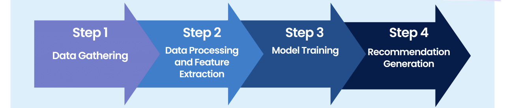

# Movie Recommendation App with PySpark

## 🏢 Description

This project implements a simple Movie Recommendation System using PySpark in the backend with a pre-trained ALS (Alternating Least Squares) model to recommend movies based on user ratings, and a Streamlit frontend for interactive user input. The app is containerized using Docker, ensuring easy deployment across different environments. It has been deployed on Render, providing a seamless platform for hosting and running the application. Users can input their user ID to receive personalized movie recommendations directly through the web interface. 




## 📦 Repo structure
```.
├── api/
│ |── app.ipynb
| ├── app.py
| └── main.py
├── data/
│ ├── movies.csv
| ├──ratings.csv
├── model/
├── .gitignore
├── flow.png
├── Dockerfile
├── README.md
└── requirements.txt
```

## 👩‍💻 Usage

### Streamlit

To run the app locally, follow the steps below:

Clone the repository to your local machine.

```
# Clone the repository
git clone 

# Install dependencies
pip install -r requirements.txt

# Launch the Streamlit app locally
streamlit run app/app.py
```
To use streamlit application follow this website: https://recommender-systems.onrender.com

### Docker

This app can be easily containerized using Docker. The provided Dockerfile allows you to build and run the app in a Docker container.
```
# Build the Docker Image
docker build -t movie-recommendation-app .

# Run the Docker Container
docker run -p 8501:8501 movie-recommendation-app
```

## ⏱️ Timeline

This project took 5 days for larning and completion.

## 📌 Contributors
This project was done as part of the AI Boocamp at BeCode.org. 

Find me on [LinkedIn](https://www.linkedin.com/in/veena-bhawani-b41804111/) for collaboration, feedback, or to connect.
